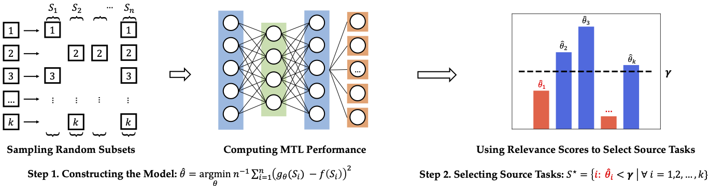

### **Overview**

This repository contains the implementation for the paper "Identification of Negative Transfers in Multitask Learning Using Surrogate Models," published in the Transactions of Machine Learning Research (TMLR) in March 2023. The repository provides a general framework for building multitask learning systems with transformers. We hope that this can aid future work in building multitask learning systems.

Our work proposes a scalable approach to identifying negative transfers that occur in multitask learning through surrogate modeling. Our approach involves selecting subsets of auxiliary source tasks to optimize the performance of a primary target task. To achieve this, our approach consists of two main components:

- First, we sample random subsets of source tasks and precompute their multitask learning performance. We fit the performances with linear regression and predict the performances on unseen task subsets. The fitted model provides a relevance score between each task and the primary target task.
- Second, we perform subset selection on source tasks by choosing the tasks with a relevance score below a certain threshold, which is obtained by optimizing the surrogate model in terms of task subsets.

<div align=center></div>

### **Requirements**

We conduct our experiments in the following Python environment and with the following packages:

- Python >= 3.6
- PyTorch >= 1.10.0 with CUDA 11.3
- transformers >= 4.12.5. We include a full copy of Hugging Face Transformers in our code for convenience.
- datasets >= 1.17.0. We use datasets to manage and download the NLP datasets.
- wrench >= 1.1.2. We refer readers to [this page](https://github.com/JieyuZ2/wrench) for instructions on installing the Wrench benchmark.

We provide the full list of packages used in our Python environment. To install the requirements:

```bash
pip install -r requirements.txt
```

### **Usage**

The code in this repo provides an example to conduct multitask learning using BERT models. The folder structure is as follows:

```
Task-Modeling/
├── trainer/ - Containing the main logic for training and evaluation
│   ├── base_trainer.py - The basic logic of conduct multitask learning
│   └── ... - Implementing your own trainer inheriting BaseTrainer
├── models/ 
│   ├── modeling_multi_bert.py - Bert model with multi prediction heads on top
│   └── prediction_heads.py - Defining prediction heads for various tasks
│   └── ... - Add your own model architecture in transfromers 
├── data_loaders/ - The logics for processing different datasets
│   └── multitask_dataset.py - The basic logic to combine multiple datasets 
│   └── collators.py - Batch collators for various datasets
│   └── load_data_fns.py - Functions to load raw data into transformer datasets
│   └── ...
├── metrics/ - Evaluation metrics for various tasks
│   ├── ... - Write your own evaluation metric if it is not defined in datasets
├── utils/ - small utility functions
│   ├── ... 
├── results/ - Files to store the multitask learning performances
├── affinity/ - Files to store the task affinity scores
├── train_multitask.py 
├── ...
```

**Customization:**

- **Add new dataset:**
  - Specify the `task_to_benchmark`, `task_to_collator`, and `task_to_load_fns` in `data_loaders/__init__.py`. Write specific collator and load functions in `collators.py` and `load_data_fns.py` if the new dataset does not fit into the default collator and loading logic.
  - Specify the `task_to_metric_name` in `metrics/__init__.py`. If the new metric is not defined in the `datasets` package, write a new metric file under the `./metrics` folder following the `huggingface-datasets` instructions.
  - Specify the `task_to_prediction_heads` in `models/__init__.py`.
- **Add new architecture:** Write a new file for the new architecture and rewrite the `forward()` function to enable taking multitask dataset batches. See the `MultitaskBertForClassification` in `modeling_multi_bert.py` for an example.

**Experiments on Multitask Weak Supervision**

Thanks to Zhang et al. for providing the weak supervision datasets online. Please visit their [GitHub page](https://github.com/JieyuZ2/wrench) to download the datasets. Download the dataset into the `./ws_datasets` folder. For example, unzip the cdr dataset as `./ws_datasets/cdr/`.

Use `python train_multitask_ws.py` to run the code. Specify the following main arguments:

- `--ws_task_name` specifies the text dataset name. Choose from `youtube`, `trec`, `cdr`, `chemprot`, `semeval`.
- `--lf_idxes` specifies the weak supervision source indexes. `0` represents the full dataset with true labels. Weak supervision sources range from `1` to `# of ws sources`. Please see the [WRENCH](https://github.com/JieyuZ2/wrench) benchmark for the number of sources in each dataset.
- `--save_name` specifies the name of a `.csv` file to save the results of training. This is crucial if one wants to save the results for further use.

Refer to the following scripts to conduct the experiments.

```bash
python train_multitask_ws.py --use_ws_dataset --use_one_predhead \\
    --ws_task_name youtube --model_name_or_path bert-base-uncased --lf_idxes 6 2 5 7 4 3 \\
    --monitor_mode max --monitor_metric val_youtube_0_f1\\
    --lr 5e-5 --epochs 5 --runs 5 --device 0 --save_name ws_baseline
    
python train_multitask_ws.py --use_ws_dataset --use_one_predhead \\
    --ws_task_name trec --model_name_or_path bert-base-uncased \\
    --lf_idxes 65 18 45 40 52 68 27 67 66 63 48 28 2 14 31 11 7 26 24 20 64 54 8 9 53 3 23 22 16 50 57 19 43 46 35 62 10 15 41 49 37 1 47 33 6 34 56 30 60 21 4 17 44 55 13 59 58 39 32 25 29 51 61 38\\
    --monitor_mode max --monitor_metric val_trec_0_f1\\
    --lr 1e-4 --epochs 5 --runs 5 --device 0 --save_name ws_baseline
    
python train_multitask_ws.py --use_ws_dataset --use_one_predhead \\
    --ws_task_name cdr --model_name_or_path bert-base-uncased --lf_idxes 9 15 13 4 25 20 19 10 2 7 23 33 1 30 31 3 6 8 16 28 17 21 24 27 29 22 12 26 14 32 18\\
    --monitor_mode max --monitor_metric val_cdr_0_f1\\
    --lr 2e-5 --epochs 5 --runs 5 --device 0 --save_name ws_baseline
    
python train_multitask_ws.py --use_ws_dataset --use_one_predhead \\
    --ws_task_name chemprot --model_name_or_path bert-base-uncased --lf_idxes 14 17 16 4 6 13 23 12 8 20 1 5 3 19 21 25 7 10 15 2 \\
    --monitor_mode max --monitor_metric val_chemprot_0_accuracy\\
    --lr 2e-5 --gradient_accumulation_steps 2 --epochs 5 --runs 5 --device 0 --save_name ws_baseline
    
python train_multitask_ws.py --use_ws_dataset --use_one_predhead \\
    --ws_task_name semeval --model_name_or_path bert-base-uncased \\
    --lf_idxes 133 135 41 134 130 129 44 42 136 132 131 43 51 138 56 53 54 48 52 45 46 57 49 37 64 12 13 118 103 17 80 50 55 47 60 25 107 35 27 38 102 71 157 6 65 32 86 92 99 72 29 16 31 122 84 73 30 140 74 76 78 105 91 23 18 20 15 81 95 93 152 79 156 88 4 63 59 145 21 11 154 94 3 96 153 9 75 66 114 110 106 7 89 148 97 98 77 128 14 85 116 82 10 19 62 123 127 34 108 112 68 69 67 26 40 1 87 61 28 164 2 58 124 139 5 104 149 155 146 121 125 109 120 150 8 70 100 90 119 158 22 83 101 141 142 143 160 33 163 39 151 113 162 24 159 111 36 126 117\\
    --monitor_mode max --monitor_metric val_semeval_0_f1\\
    --lr 1e-4 --epochs 5 --runs 5 --device 0 --save_name ws_baseline
```

**Experiments with NLP tasks**

Use `python train_multitask.py` to run the code. Specify `--task_names` for the tasks combined in multitask learning.

Refer to the following scripts to conduct the experiments.

```bash
python train_multitask.py --task_names cola cb anli_r1 stance_hillary \\
    --model_name_or_path bert-base-cased --lr 2e-5 --batch_size 8 --gradient_accumulation_steps 4 \\
    --device 1 --save_name selected_tasks

python train_multitask.py --task_names rte cb anli_r1 anli_r2 \\
    --model_name_or_path bert-base-cased --lr 5e-5 --batch_size 8 --gradient_accumulation_steps 4\\
    --device 1 --save_name selected_tasks

python train_multitask.py --task_names cb stance_abortion boolq stance_atheism \\
    --model_name_or_path bert-base-cased --lr 5e-5 --batch_size 8 --gradient_accumulation_steps 4 \\
    --device 1 --save_name selected_tasks

python train_multitask.py --task_names copa rte boolq emotion cb hate stance_abortion stsb \\
    --model_name_or_path bert-base-cased --lr 5e-5 --batch_size 8 --gradient_accumulation_steps 4 \\
    --device 1 --save_name selected_tasks

python train_multitask.py --task_names wsc stance_climate boolq stsb cola stance_hillary stance_feminist irony\\
    --model_name_or_path bert-base-cased --lr 4e-5 --batch_size 8 --gradient_accumulation_steps 4 \\
    --device 1 --save_name selected_tasks
```

**Sampling Subsets for Task Modeling**

Use `train_sample_ws_tasks.py` and `train_sample_tasks.py` to sample subsets and collect results for task modeling. For example, a script to train sampled sets on the YouTube dataset is shown below.

```
python train_sample_ws_tasks.py \\
    --ws_task_name youtube --num_samples 200\\
    --min_task_num 3 --max_task_num 3\\
    --device 0 --lr 2e-5 --epochs 5 --runs 5\\
    --task_set_name ws_sampled_tasks_youtube\\
    --save_name ws_sampled_tasks_youtube
```

We describe the important arguments in the following. For the rest of arguments, please refer to the script `train_sample_ws_tasks.py`.

- `--min_task_num` and `--max_task_num` specify the number of source tasks that are sampled into the training. The script will uniformly sample from subsets of source tasks whose size is between `min_task_num` and `max_task_num`.
- `--task_set_name` specifies a file to record sampled tasks to avoid repeated results.
- `--save_name` specifies the name for a `.csv` file to store the training results. This is crucial since we need the results for learning task models.

For `train_sample_tasks.py`, use `—-target_task` to specify the main target task of modeling.

### Citation

If you find this repository useful or happen to use it in a research paper, please cite our work with the following bib information.

```latex
@article{li2023identification,
  title={Identification of Negative Transfers in Multitask Learning Using Surrogate Models},
  author={Li, Dongyue and Nguyen, Huy and Zhang, Hongyang Ryan},
  journal={Transactions on Machine Learning Research},
  year={2023}
}
```

### Acknowledgment

Thanks to the authors of the following repositories for providing their implementation publicly available.

- [wrench](https://github.com/JieyuZ2/wrench)
- [MT-DNN](https://github.com/namisan/mt-dnn)
